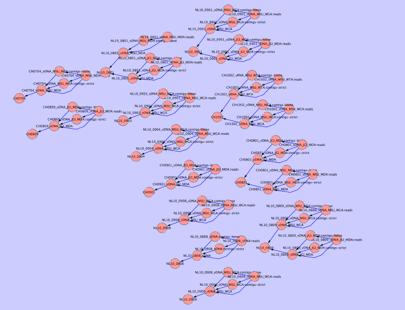

Creating a graph of collections
===============================

Collections in MetagenomeDB can be related to each other so that any given collection can have sub- or super-collections (see :doc:`../api/relationships` and `../api/collection`). You can create a graphic of all collections in your database and their relationships using a network visualization software such as `Cytoscape <http://www.cytoscape.org/>`_.

Here is the code, with comments, that will generate such graphic::

	#!/usr/bin/env python

	import MetagenomeDB as mdb

	### User-modifiable parameters
	network_fn = "network.sif"
	###

	# first, we create the file that will contain our network
	# as a list of edge, following the Cytoscape .SIF format
	# (see http://cytoscape.wodaklab.org/wiki/Cytoscape_User_Manual/Network_Formats)
	network_fh = open(network_fn, 'w')

	# edges will be stored at first as keys of a dictionary
	# to avoid duplicates
	edges = {}

	# for each collection in the database,
	for collection in mdb.Collection.find():
		# for each sub-collection of this collection (if any),
		for sub_collection in collection.list_sub_collections():
			# we store a directed edge from this sub-collection to the collection
			edges[sub_collection, collection] = True

		# for each super-collection of this collection (if any),
		for super_collection in collection.list_super_collections():
			# we store a directed edge from this collection to the super-collection
			edges[collection, super_collection] = True

	# finally, we write those directed edges in the output file
	for (collection_a, collection_b) in sorted(edges.keys()):
		print >>network_fh, "%s	part_of	%s" % (collection_a["name"], collection_b["name"])

This code is also available as a :download:`download <graph_of_collections.py>`.

Once this script is executed the resulting ``network.sif`` file can be loaded into Cytoscape, producing an output similar to this one:

.. toctree::
	:hidden:
