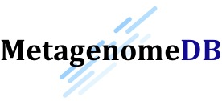

**MetagenomeDB** is a Python_-powered toolkit designed to easily store, retrieve and annotate genomic and metagenomic sequences. It is especially useful when dealing with large amount of sequences (e.g., reads and contigs resulting from several runs of sequencing and assembly), and offers a clean, programmatic interface to manage and query this information.

This page contains everything you need to know to use **MetagenomeDB**.

Overview
--------

:doc:`introduction`
	Introduction to the MetagenomeDB toolkit.

:doc:`installation/index`
	How to install the MetagenomeDB toolkit. Version covered in this documentation: |release|

:doc:`tutorial/index`
	How to use MetagenomeDB to perform common tasks.

:doc:`recipes/index`
	Sample code to perform various analysis tasks.

:doc:`api/index`
	Documentation for the Python library.

:doc:`tools/index`
	Documentation for the command-line tools.

.. toctree::
	:hidden:

	introduction
	installation/index
	tutorial/index
	recipes/index
	api/index
	tools/index

.. _Python: http://www.python.org/
.. _MongoDB: http://www.mongodb.org/

Community
---------

**MetagenomeDB** is an open-source project managed by the `Bioinformatics Core <http://cores.montana.edu/bioinformatics/>`_ of the `Montana State University <http://www.montana.edu/>`_. The developer team can be contacted by email, at bioinformatics.core@montana.edu.

