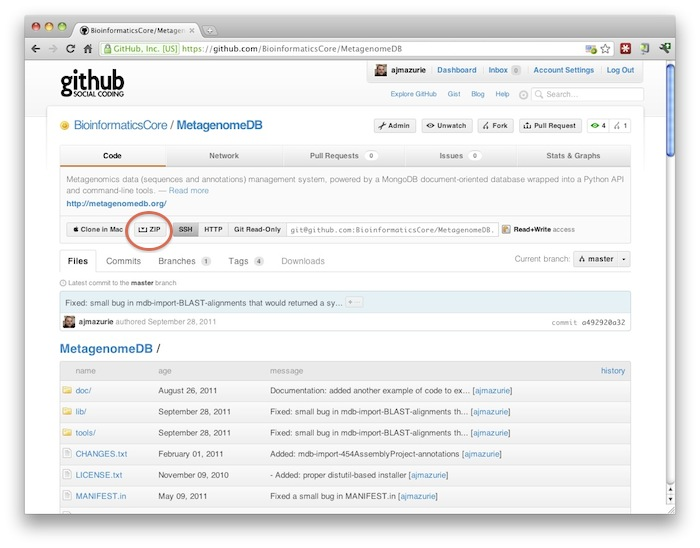

Installation
============

**MetagenomeDB** relies on another Python library to function, Pymongo_ (version 1.9 or above). The latest version of Pymongo must be installed, for example by typing ``sudo easy_install Pymongo`` on the command line (if ``easy_install`` is not installed on your computer, read the documentation here: http://pypi.python.org/pypi/setuptools).

That's it. The only other requirement is, of course, a working MongoDB_ server, either on your computer or on a computer that can be accessed through TCP/IP. Documentation on how to install a MongoDB server can be found here: http://www.mongodb.org/display/DOCS/Quickstart.

MetagenomeDB itself can be installed using two methods:

Using GitHub
''''''''''''

This is the recommended method. `GitHub <http://github.com>`_ is a repository of community-driven open-source projects, allowing people to download the source code of projects, modify it and submit their modifications. The source code of MetagenomeDB is stored at this page: https://github.com/BioinformaticsCore/MetagenomeDB

You can download a .zip archive of the latest version of MetagenomeDB by clicking on the "ZIP" button on this page:

You should obtain a file named ``BioinformaticsCore-MetagenomeDB-vXXXX.zip`` where 'XXXX' is a version and build number. The latest version of MetagenomeDB is for now |release|.

Once the archive in your computer, installing it can be done by typing ``sudo easy_install [path to your archive]`` in a console [#]_

If you want more control (such as requesting the library and the tools to be installed in specific directories), you should first unzip the archive, ``cd`` into this directory then type ``sudo python setup.py`` plus any wanted option [#]_. For example, to ensure the various mdb-* tools are installed in /usr/local/bin/ you can type ``sudo python setup.py install --install-scripts=/usr/local/bin/``.

.. [#] see the ``easy_install`` documentation: http://packages.python.org/distribute/easy_install.html.

.. [#] see the ``setup.py`` documentation: http://docs.python.org/install/index.html

Using PyPI
''''''''''

All production-ready versions of MetagenomeDB are registered against the PyPI_ package manager. Thanks to this, you can install the toolkit by typing ``sudo easy_install MetagenomeDB`` on the command line.

Final step
''''''''''

By default MetagenomeDB will read a file named ``.MetagenomeDB`` in your home directory to know how to access the MongoDB database. A template file named ``docs/installation/MetagenomeDB_configuration.txt`` is provided. Copy this file into your home directory, change its name to ``.MetagenomeDB``, then update it with your own parameters.

Optionally, you can provide those information when importing MetagenomeDB in your script::

	import MetagenomeDB as mdb

	mdb.connect(host = "localhost", port = 1234, database = "MyDatabase")

.. _MongoDB: http://www.mongodb.org/
.. _Pymongo: http://api.mongodb.org/python
.. _PyPI: http://pypi.python.org/

.. toctree::
	:hidden:
