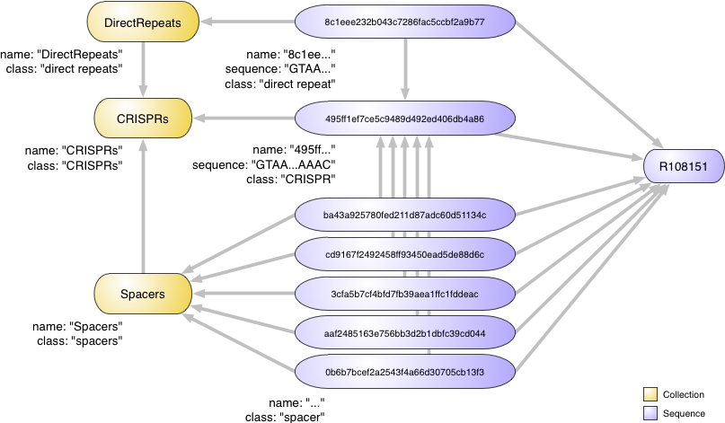

mdb-import-CRISPRfinder-annotations: Importing CRISPR annotations from CRISPRfinder
===================================================================================

``mdb-import-CRISPRfinder-annotations`` annotates sequences with `CRISPR <http://en.wikipedia.org/wiki/CRISPR>`_ loci as annotated by the `CRISPRfinder <http://crispr.u-psud.fr/Server/>`_ online tool; more specifically, by reading the ``AnnotFasta`` file produced by this later tool.

Syntax
------

The syntax of this command-line tool is the following::

	Usage: mdb-import-CRISPRfinder-annotations [options]

	Part of the MetagenomeDB toolkit. Imports CRISPR annotations generated by
	CRISPRfinder into the database.

	Options:
	  -h, --help            show this help message and exit
	  --ignore-duplicates   If set, ignore duplicate objects errors.
	  -v, --verbose         
	  --dry-run             

	  Input:
		-i FILENAME, --input=FILENAME
							CRISPR annotations to import (mandatory). Must be the
							'AnnotFasta' file produced by CRISPRfinder.
		-C STRING, --collection=STRING
							Name of the collection that contains the sequences to
							annotate (mandatory).
		--id-getter=PYTHON CODE
							Python code to reformat sequence identifers
							(optional); '%' will be replaced by the sequence
							identifier. Default: %
		--id-patches=FILENAME
							Tab-delimited text files providing alternative
							sequence identifiers (optional). The first column
							should be the identifier found in the input file, and
							the second column the identifier to consider for this
							sequence.
		--CRISPR-property=KEY VALUE
							CRISPRs property (optional).
		--spacer-property=KEY VALUE
							Spacers property (optional).
		--DR-property=KEY VALUE
							Direct repeats property (optional).
		--date=YEAR MONTH DAY
							Date of the CRISPRfinder run (optional). By default,
							creation date of the input file.

	  Collections:
		-c STRING, --CRISPRs-collection=STRING
							Name of the collection the CRISPRs belong to
							(optional). Default: 'CRISPRs'
		-s STRING, --spacers-collection=STRING
							Name of the collection the spacers belong to
							(optional). Default: 'Spacers'
		-d STRING, --DRs-collection=STRING
							Name of the collection the direct repeats belong to
							(optional). Default: 'DirectRepeats'

	  Connection:
		--host=HOSTNAME     Host name or IP address of the MongoDB server
							(optional). Default: localhost
		--port=INTEGER      Port of the MongoDB server (optional). Default: 27017
		--db=STRING         Name of the database in the MongoDB server (optional).
							Default: 'MetagenomeDB'
		--user=STRING       User for the MongoDB server connection (optional).
							Default: ''
		--password=STRING   Password for the MongoDB server connection (optional).
							Default: ''

Usage
-----

``mdb-import-CRISPRfinder-annotations`` works by first creating a set of three collections to store CRISPRs and their composing spacers and direct repeats (see this `definition <http://crispr.u-psud.fr/Server/CRISPRfinderDefinitions.html#CRISPR_def>`_). Any sequence annotated with ``mdb-import-CRISPRfinder-annotations`` will be linked to automatically generated CRISPR, spacers and direct repeat from these three collections, respectively (see :doc:`../api/relationships`).

For example, let us imagine the following ``AnnotFasta`` file produced by CRISPRfinder::

	>R108151
	GTAACAACTGAAAGAAACTAAAAC     AGGCGTGTTAGTTATCGTTGTGGGAACTGGACTGGA  1
	GTAACAACTGAAAGAAACTAAAAC     AAACTGTTAAATACAAATTCAAGATGGGGGTAACT  2
	GTAACAACTGAAAGAAACTAAAAC     TGTACTAAATTATAGGGGAATGGCGCTGAGGGAAGAGT  3
	GTAACAACTAAAAGAAACTAAAAC     CTTCTACTACTTCGTAATTGCCGTAGCTTATTATT  4
	GTAACAACTGAAAGAAACTAAAAC     ATCTGGCACTGGCGTACCGTCTGGTACGCCGTTCT  5
	GTAACAACTGAAAGAAACTAAAAC     

.. |dash|   unicode:: U+00AD

It means the sequence 'R108151' is found to contain a CRISPR of sequence 'GTAACAACTG\ |dash|\ AAAGAAACTA\ |dash|\ AAACAGGCGT\ |dash|\ GTTAGTTATC\ |dash|\ GTTGTGGGAA\ |dash|\ CTGGACTGGA\ |dash|\ GTAACAACTG\ |dash|\ AAAGAAACTA\ |dash|\ AAACAAACTG\ |dash|\ TTAAATACAA\ |dash|\ ATTCAAGATG\ |dash|\ GGGGTAACTG\ |dash|\ TAACAACTGA\ |dash|\ AAGAAACTAA\ |dash|\ AACTGTACTA\ |dash|\ AATTATAGGG\ |dash|\ GAATGGCGCT\ |dash|\ GAGGGAAGAG\ |dash|\ TGTAACAACT\ |dash|\ AAAAGAAACT\ |dash|\ AAAACCTTCT\ |dash|\ ACTACTTCGT\ |dash|\ AATTGCCGTA\ |dash|\ GCTTATTATT\ |dash|\ GTAACAACTG\ |dash|\ AAAGAAACTA\ |dash|\ AAACATCTGG\ |dash|\ CACTGGCGTA\ |dash|\ CCGTCTGGTA\ |dash|\ CGCCGTTCTG\ |dash|\ TAACAACTGA\ |dash|\ AAGAAACTAA\ |dash|\ AAC' made of a six copies of the direct repeat 'GTAACAACTGAAAGAAACTAAAAC' plus five different spacers.

``mdb-import-CRISPRfinder-annotations`` will translate this information into the following structure:

In details,

- one sequence object (see :doc:`../api/sequence`) will be created to represent the CRISPR (with property ``class`` equal to 'CRISPR'); this object will be related to both the sequence to annotate and to the 'CRISPRs' collection
- five sequence objects will be created to represent the five spacers (with properties ``class`` equal to 'spacer'); these objects will be related to the sequence to annotate, the 'Spacers' collection and the CRISPR object they are part of
- one sequence object will be created to represent the direct repeat (with property ``class`` equal to 'direct repeat'); this object will be related to the sequence to annotate, the 'DirectRepeats' collection and the CRISPR object it is part of
- all relationships between CRISPR, spacer and direct repeat sequences will have the following properties:

====================== =====
Property               Value
====================== =====
``type``               Type of relationship (always 'part-of')
``run.date.year``      Year the CRISPRfinder run was completed
``run.date.month``     Month the CRISPRfinder run was completed
``run.date.day``       Day the CRISPRfinder run was completed
``run.algorithm.name`` Name of the algorithm (always 'CRISPRfinder')
====================== =====

- finally, both 'Spacers' and 'DirectRepeats' collections will be linked to the 'CRISPRs' collection.

.. note:: The name of the 'CRISPRs', 'Spacers' and 'DirectRepeats' collections can be modified at will by using the ``--CRISPRs-collection``, ``--spacers-collection`` and ``--DRs-collection`` options, respectively

This structure will allow easy retrieval of all spacers that are part of a sequence, or for example all sequences that contains a given direct repeat.

.. note:: All CRISPRs, spacers and direct repeats created by ``mdb-import-CRISPRfinder-annotations`` during the importation process are given an automatically generated name that cannot be modified. This name is the `MD5 hash <http://en.wikipedia.org/wiki/Md5>`_ of the upper-case nucleotide sequence.

.. toctree::
	:hidden:
