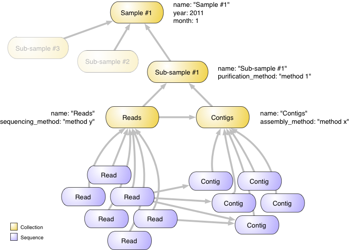

Tutorial
========

This tutorial is intended as an introduction to working with **MetagenomeDB**.

Before we start, make sure that you have the MetagenomeDB toolkit installed (see :doc:`../installation/index`). In the Python shell, the following should run without raising an exception::

   >>> import MetagenomeDB

For practical purpose, in all examples of this tutorial we will use an alias for the library, *mdb*::

   >>> import MetagenomeDB as mdb

This tutorial also assumes that a MongoDB server is running and the connection information (server host, port, name of the database, etc.) are stored in the file ``~/.MetagenomeDB``. Assuming you have `downloaded and installed <http://www.mongodb.org/display/DOCS/Getting+Started>`_ MongoDB, you can start it like so::

   $ mongod

Example
-------

MetagenomeDB allows scientists to store large amount of sequences, such as those generated by genomics and metagenomics projects. Sequences can be grouped into collections (see :doc:`../introduction`). Collections can be connected to each others (see :doc:`../api/relationships`). Finally, both sequences and collections can be annotated with arbitrary information (see :doc:`../api/annotations`).

Let's start with an example. Imagine you have collected a biological sample from an environment (soil, water, etc.), extracted some sub-samples using various purification techniques, and performed a metagenomic analysis on these sub-samples (i.e., generated reads and assembled them into contigs). MetagenomeDB will help you organizing this wealth of information by representing it according to the following structure:

At the top of this structure we have an object (a :doc:`../api/collection`) that represents your biological sample. We annotate it with a name ('Sample #1'), and the month and year this sample was collected (``month`` and ``year`` properties). You could easily add any other annotation; e.g., who collected the sample, using which sampling technique (see :doc:`../api/annotations`).

Right under this structure we have various sub-samples, also represented as collections. For display purpose, we will only focus on one of these. This sub-sample receives a name ('Sub-sample #1') and a description of the purification method used (``purification_method`` property).

This sub-sample has been sequenced, which means a set of reads has been obtained. Those reads have further been assembled into contigs. Both reads and contigs are represented by numerous :doc:`../api/sequence` objects. To better organize these two sets of sequences we create two collections, named 'Reads' and 'Contigs'. The 'Reads' collection contains information about how the sequencing was made, while the 'Contigs' collection contains information about how the assembly was made.

Arrows in this figure represent *relationships* (see :doc:`../api/relationships`) between objects. Hence, reads and contigs are related to their respective collections. Reads are also related to contigs to express the fact that some of the reads were used to assemble some of the contigs. Finally, collections are related to each other to represent how they are hierarchically organized. Think of an arrow as a 'part of' relationship: a read is *part of* the Reads collection, which itself is *part of* a sub-sample (and also *part of* the Contigs collection), which itself is *part of* a sample.

.. note:: The organization described here is completely arbitrary; MetagenomeDB can manage any number of collections and sequences you need, and any relationships between them. However, this specific organization proved the most convenient when used by biologists, and you may want to use it as a template for your own data.

Let see how to create such a structure and import your data.

Creating and linking collections
--------------------------------

The first step in creating the structure described above is to define a set of collections and their relationships. This can be done either programmatically using the API (see :doc:`../api/index`), or through command-line tools (see :doc:`../tools/index`).

Using command-line tools
........................

The first option to create your collections is to use the ``mdb-add`` command-line tool (see :doc:`../tools/mdb_add`) together with a text file (either a CSV file generated by a spreadsheet software, or a JSON file; see the tool documentation) that describes the objects and their relationships.

A CSV (*comma separated values*) file can be created by any spreadsheet software that supports this format, such as `Microsoft Excel <http://office.microsoft.com/en-us/excel/>`_, `OpenOffice <http://www.openoffice.org/>`_ or `Numbers <http://www.apple.com/iwork/numbers/>`_.

In this file each line will describe a single object, or a relationship between two objects. Each cell of this line will contain an annotation for this object or relationship.

For example, creating the collection 'Sample #1' requires the following following table:

================  ==============  =================  ===============
A                 B               C                  D
================  ==============  =================  ===============
_type=collection  name=Sample #1  year=2011^integer  month=1^integer
================  ==============  =================  ===============

.. note:: The header **A B C**... is only for display purpose; you do not have to add this line to your file.

Please note that:

- the order of the cells in each line is not important
- each cell follows the same syntax: [**property name**] = [**value of this property**] [**^optional modifier**] (spaces around the equal sign or after the value are ignored). The modifier is needed when the value of your property is not a string (as for the ``name`` property). Hence, the ``year`` and ``month`` properties are both integers. For a more complete reference, see :doc:`../tools/mdb_add`.
- one of the cell has to declare the special property ``_type`` to tell ``mdb-add`` the type of object to create. Only three values are accepted: ``collection``, ``sequence`` and ``relationship`` (case-insensitive). All properties with a starting underscore are special properties that are used by the MetagenomeDB API; you cannot use those properties to annotate your objects, or modify them.
- one of the cell has to declare the property ``name``. All collections and sequences in MetagenomeDB have at least a name; sequences also require a ``sequence`` property (see :doc:`../api/collection` and :doc:`../api/sequence`).

Creating the sub-sample 'Sub-sample #1' just means adding another line:

================  ==================  =============================  ===============
A                 B                   C                              D
================  ==================  =============================  ===============
_type=collection  name=Sample #1      year=2011^integer              month=1^integer
_type=collection  name=Sub-sample #1  purification_method=method #1
================  ==================  =============================  ===============

Finally, to connect the sub-sample to its sample, you need to declare a relationship:

==================  ========================  =============================  ========================  ======================
A                   B                         C                              D                         E
==================  ========================  =============================  ========================  ======================
_type=collection    name=Sample #1            year=2011^integer              month=1^integer
_type=collection    name=Sub-sample #1        purification_method=method #1
_type=relationship  _source._type=collection  _source.name=Sub-sample #1     _target._type=collection  _target.name=Sample #1
==================  ========================  =============================  ========================  ======================

Relationships have special properties:

- two special properties ``_source`` and ``_target`` must be provided to describe the source and the target of this relationship, respectively. Remember that relationships are always directed in MetagenomeDB (see :doc:`../api/relationships`). In our case, Sub-sample #1 is *related to* (is *part of*) Sample #1, but not the other way around.
- ``_source`` and ``_target`` must provide two sub-properties, ``name`` and ``_type``. ``name`` is the name of the object you want to connect, while ``_type`` is its type. In our example, we want to connect a collection to another. Connecting a sequence to a collection (or a sequence to another sequence) would require a third sub-property, ``_collection``, to indicate which collection this sequence belong to. However adding sequences to a collection is typically done using the ``mdb-import-sequences`` command-line tool, described below.

That's it! This is the only thing you need to know to describe your collections and their relationships. Here is the final table, including the 'Reads' and 'Contigs' collections. This table is also available as a download: :download:`table.csv`.

==================  ========================  =============================  ========================  ======================
A                   B                         C                              D                         E
==================  ========================  =============================  ========================  ======================
_type=collection    name=Sample #1            year=2011^integer              month=1^integer
_type=collection    name=Sub-sample #1        purification_method=method #1
_type=relationship  _source._type=collection  _source.name=Sub-sample #1     _target._type=collection  _target.name=Sample #1
_type=collection    name=Reads                sequencing_method=method y
_type=collection    name=Contigs              assembly_method=method x
_type=relationship  _source._type=collection  _source.name=Reads             _target._type=collection  _target.name=Sub-sample #1
_type=relationship  _source._type=collection  _source.name=Contigs           _target._type=collection  _target.name=Sub-sample #1
_type=relationship  _source._type=collection  _source.name=Reads             _target._type=collection  _target.name=Contigs
==================  ========================  =============================  ========================  ======================

From there you can call ``mdb-add`` with the name of your CSV file as an argument ::

	$ mdb-add -i table.csv

The output should be::

	4 collections added
	4 relationships added

Your objects are now in the database. Later you will want to look at the documentation for ``mdb-add`` (:doc:`../tools/mdb_add`) to know how to deal with special cases, such as duplicate objects, and to learn more about the syntax for property values.

Using the API
.............

The same structure can be created using the MetagenomeDB API; i.e., by writing a Python script. Here is the equivalent of the above structure declaration using the API::

	import MetagenomeDB as mdb

	# first, we create a new Collection object for the sample. The Collection()
	# class takes as an argument a dictionary with all properties you want to
	# annotate this collection with.
	sample = mdb.Collection({"name": "Sample #1", "year": 2011, "month": 1})

	# once created, you need to commit this collection to the database.
	sample.commit()

	# similarly, we create a Collection object for the sub-sample
	subsample = mdb.Collection({"name": "Sub-sample #1", "purification_method": "method #1"})

	# we then link this sub-sample to the sample
	subsample.add_to_collection(sample)

	# then we commit it
	subsample.commit()

	# same thing for the 'Reads' and 'Contigs' collections:
	reads = mdb.Collection({"name": "Reads", "sequencing_method": "method y"})
	contigs = mdb.Collection({"name": "Contigs", "assembly_method": "method x"})

	contigs.add_to_collection(subsample)
	contigs.commit()

	# please note here that 'contigs' needs to be committed before
	# we relate 'reads' to it:
	reads.add_to_collection(subsample)
	reads.add_to_collection(contigs)
	reads.commit()

For a more complete documentation of the API, please refer to the :doc:`../api/index`.

Importing sequences
-------------------

Once your collections have been created you are ready to import sequences; in our examples, the sets of reads and contigs generated by a metagenomic analysis.

.. note:: Sequences do not have to be related to a collection in MetagenomeDB. However this is extremely convenient to describe them as a set (e.g., the set of all reads generated by a sequencing run). Also, all command-line tools dealing with sequences will expect them to be part of a collection.

You could use the same approach as above; i.e., creating a CSV file with a sequence description per line (with properties such as the nucleotide sequence, the sequence name, etc.) and a relationship between this sequence and the collection (either 'Reads' or 'Contigs'), then importing this file by calling ``mdb-add``. However, a dedicated tool is provided to import sequences from a variety of file formats: ``mdb-import-sequences`` (see :doc:`../tools/mdb_import_sequences`).

``mdb-import-sequences`` can read nucleotide and protein sequences from FASTA files as well as all formats supported by the Biopython library, such as GenBank or FASTQ (for a complete list, please refer to the Biopython `documentation <http://www.biopython.org/wiki/SeqIO#File_Formats>`_).

Importing a set of reads from a file ``reads.fasta`` into the 'Reads' collection is achieved by typing the following on the command-line::

	$ mdb-import-sequences -i reads.fasta -C Reads

Similarly for contigs in a ``contigs.fasta`` file::

	$ mdb-import-sequences -i contigs.fasta -C Contigs

``mdb-import-sequences`` comes with extra features, such as annotating all sequences from the same file with a same property and value. This can be useful, for example, when you want to add a property ``class`` with value 'read' for all reads, or 'contig' for all contigs. The syntax becomes::

	$ mdb-import-sequences -i reads.fasta -C Reads -c class read
	$ mdb-import-sequences -i contigs.fasta -C Contigs -c class contig

For a complete documentation of ``mdb-import-sequences``, see :doc:`../tools/mdb_import_sequences`.

Connecting sequences
--------------------

The reads and contigs you just imported are not disconnected. In fact, for each contig there is a set of reads that has been used for its assembly. Again, you could import this information as a set of relationships defined in a CSV file. But another tool, ``mdb-import-ACE-alignments`` (see :doc:`../tools/mdb_import_ace_alignments`) is available to import reads-to-contig mapping in the `ACE format <http://en.wikipedia.org/wiki/ACE_file_format>`_, often generated by assembly programs.

Hence, to import an assembly file ``mapping.ace`` you need to provide the name of the collection that contains your reads and the one containing your contigs::

	$ mdb-import-ACE-alignments -i mapping.ace -R Reads -C Contigs

``mdb-import-ACE-alignments`` comes with several features, such as ignoring missing reads or contigs (i.e., reads or contigs defined in the ACE file but not present in the database) or converting on-the-fly the read or contig identifiers. For a complete documentation, see :doc:`../tools/mdb_import_ace_alignments`.

Modifying existing objects
--------------------------

We saw earlier how to define collections and/or sequences using a CSV file and the ``mdb-add`` tool, or by using the API. However, what about modifying objects that have been already created? You can add, modify (i.e., replace, append to) or remove any property of an object by using either the command line or the API.

Using the command line
......................

The ``mdb-annotate`` tool (:doc:`../tools/mdb_annotate`) is available to modify existing objects, using the same approach as ``mdb-add``; i.e., by creating a CSV or JSON file with instructions for these objects.

The syntax of this file is the same as for ``mdb-add``. The only difference is the availability of *operators*. Hence, the following CSV file will replace the property ``year`` of the collection 'Sample #1' by the value 2010:

================  ==============  =================
A                 B               C              
================  ==============  =================
_type=collection  name=Sample #1  year=2010^integer
================  ==============  =================

What next?
----------

Done. All your data are now in the database. At this stage you can query the database (see :doc:`../api/queries`) and/or export some of its content (see :doc:`../tools/index`). In the :doc:`../examples/index` section you will find some examples of such activities, such as managing sequence alignments (as produced by BLAST or FASTA) or producing Cytoscape networks out of your data.

.. toctree::
	:hidden:
